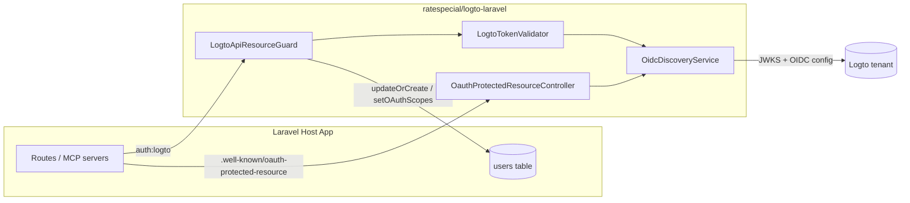
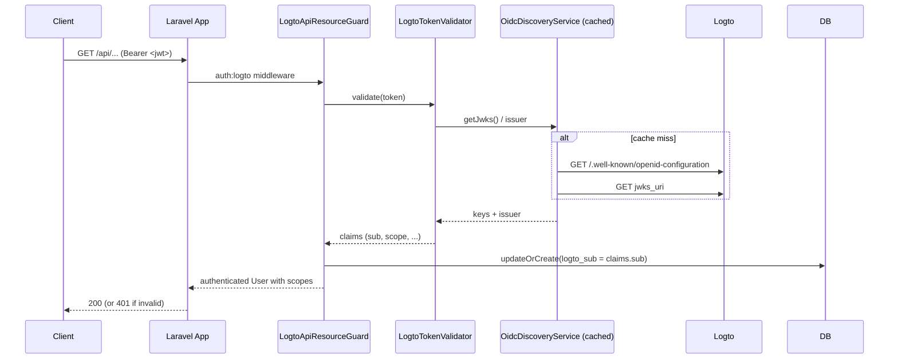
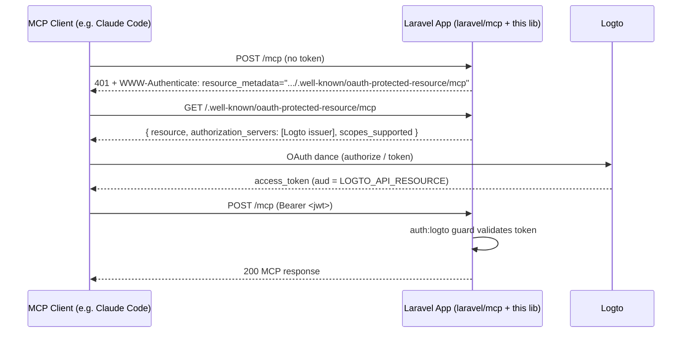

# logto-laravel

Logto.io (OAuth/OIDC) support for Laravel. This package contributes two independent features:

1. **`logto-api-resource` guard** — a Laravel auth guard that validates Logto-issued JWT access tokens and JIT-provisions users.
2. **MCP protected-resource controller** — an [RFC 9728](https://www.rfc-editor.org/rfc/rfc9728) `/.well-known/oauth-protected-resource` endpoint that lets [`laravel/mcp`](https://github.com/laravel/mcp) use Logto as its identity provider instead of Passport or Sanctum.

**Requirements:** PHP `^8.3`, Laravel 11, a Logto tenant.

## Installation

```bash
composer require ratespecial/logto-laravel
```

The service provider is auto-registered via Laravel's package discovery.

## Configuration

The package reads from both `config/logto.php` (published automatically via `mergeConfigFrom`) and `config/services.php`. Set these in your host app's `.env`:

```dotenv
LOGTO_ENDPOINT=https://your-tenant.logto.app
LOGTO_API_RESOURCE=https://api.example.com
LOGTO_CACHE_TTL=600
LOGTO_SUBJECT_COLUMN=logto_sub

# MCP feature (off by default)
LOGTO_MCP_ROUTES=true
LOGTO_MCP_SCOPES="mcp:use"
```

| Env var | Config key | Default | Purpose |
| --- | --- | --- | --- |
| `LOGTO_ENDPOINT` | `services.logto.endpoint` | — | Your Logto tenant URL. **Required.** |
| `LOGTO_API_RESOURCE` | `services.logto.api-resource` | `url('/')` | JWT audience this API accepts. **Required.** |
| `LOGTO_CACHE_TTL` | `services.logto.cache-ttl` | `600` | TTL (seconds) for cached OIDC discovery + JWKS. |
| `LOGTO_SUBJECT_COLUMN` | `logto.subject-column` | `logto_sub` | User-model column that stores the JWT `sub` claim. |
| `LOGTO_MCP_ROUTES` | `logto.mcp.routes` | `false` | Enables the RFC 9728 discovery routes. |
| `LOGTO_MCP_SCOPES` | `logto.mcp.scopes-supported` | `mcp:use` | Space-delimited scopes advertised in the discovery metadata. |
| `LOGTO_MCP_PROTECTED_RESOURCE_MIDDLEWARE` | `logto.mcp.protected-resource-middleware` | `''` | Comma-delimited middleware applied to the discovery route. |

The provider binds `LogtoTokenValidator` and `OidcDiscoveryService` from `services.logto.*`, so add these entries to `config/services.php`:

```php
'logto' => [
    'endpoint'     => env('LOGTO_ENDPOINT'),
    'api-resource' => env('LOGTO_API_RESOURCE'),
    'cache-ttl'    => (int) env('LOGTO_CACHE_TTL', 600),
],
```

The JWT-claim → user-model attribute mapping defaults to `email` and `name`. Override `logto.model-attributes` by publishing the config or merging into it from a service provider.

## High-level Architecture



---

## Feature 1 — The `logto-api-resource` Guard

The guard:

- Reads the bearer token from the incoming request.
- Validates signature, issuer (`iss`), and audience (`aud`) against Logto's OIDC discovery document and JWKS — both cached for `LOGTO_CACHE_TTL` seconds.
- JIT-provisions a user via `updateOrCreate`, keyed on `logto.subject-column`. Attributes are mapped from JWT claims using `logto.model-attributes`.
- Attaches the `scope` claim to the in-memory user. A global `Gate::before` hook then makes `can:<scope>` middleware and `$user->can('<scope>')` work transparently.
- Dispatches `Ratespecial\Logto\Events\UserProvisionedEvent` the first time a given `sub` is seen.

### Request flow



### Migrations

The user model must have a column matching `logto.subject-column` (default `logto_sub`). Two migration groups are publishable — pick the one that fits your project:

```bash
# Fresh project — full users table with the subject column included
php artisan vendor:publish --tag=logto-migrations-users

# OR — existing users table; just add the logto_sub column
php artisan vendor:publish --tag=logto-migrations-logto-sub

php artisan migrate
```

If you want a different column name, publish the migration, rename the column, and set `LOGTO_SUBJECT_COLUMN` to match.

### User model

Your user model must use the `HasOAuthScopes` trait and implement the `OAuthScopable` contract so the guard can write scopes to it and the `Gate::before` hook can read them back.

```php
namespace App\Models;

use Illuminate\Foundation\Auth\User as Authenticatable;
use Ratespecial\Logto\Contracts\OAuthScopable;
use Ratespecial\Logto\HasOAuthScopes;

class User extends Authenticatable implements OAuthScopable
{
    use HasOAuthScopes;

    protected $fillable = ['name', 'email', 'logto_sub'];
}
```

### Guard registration

The service provider auto-merges an `auth.guards.logto` entry, but you still need to point its `provider` at one of your `auth.providers.*` entries. In `config/auth.php`:

```php
'guards' => [
    'logto' => [
        'driver'   => 'logto-api-resource',
        'provider' => 'users',
    ],
],

'providers' => [
    'users' => [
        'driver' => 'eloquent',
        'model'  => App\Models\User::class,
    ],
],
```

### Protecting routes

```php
use Illuminate\Support\Facades\Route;
use App\Http\Controllers\OrderController;

// Authenticate only
Route::get('/api/me', fn () => auth('logto')->user())
    ->middleware('auth:logto');

// Authenticate + require a Logto OAuth scope
Route::get('/api/orders', [OrderController::class, 'index'])
    ->middleware(['auth:logto', 'can:orders:read']);
```

`can:orders:read` works because the service provider installs a `Gate::before` hook that delegates ability checks to `$user->hasOAuthScope($ability)`. The same is true of programmatic checks like `$user->can('orders:read')` or `Gate::allows('orders:read')`.

### Reacting to new users

```php
use Illuminate\Support\Facades\Event;
use Ratespecial\Logto\Events\UserProvisionedEvent;

Event::listen(function (UserProvisionedEvent $event) {
    // $event->user is the freshly-created Authenticatable
    // Send a welcome email, kick off onboarding, etc.
});
```

---

## Feature 2 — MCP Protected Resource Controller

[`laravel/mcp`](https://github.com/laravel/mcp) ships with first-class support for Laravel Passport. This package adds a parallel discovery endpoint so MCP clients (e.g. Claude Code) can authenticate against your **Logto** tenant instead.

It exposes RFC 9728 metadata at:

- `GET /.well-known/oauth-protected-resource`
- `GET /.well-known/oauth-protected-resource/{path?}` (named `mcp.oauth.protected-resource.nested`)

`laravel/mcp`'s `AddWwwAuthenticateHeader` middleware builds the `WWW-Authenticate` URL from the nested route name, so simply registering these routes wires the discovery handshake end-to-end. **These endpoints must not sit behind authentication middleware** — they're public discovery documents.

### Discovery handshake



### Enable the discovery routes

```dotenv
LOGTO_MCP_ROUTES=true
LOGTO_MCP_SCOPES="mcp:use"
```

When `logto.mcp.routes` is true, the service provider loads `routes/mcp-routes.php`, which registers both `/.well-known/oauth-protected-resource` endpoints. The advertised `scopes_supported` array comes from `LOGTO_MCP_SCOPES` (space-delimited).

### Protecting an `Mcp::web` server with the Logto guard

In `routes/ai.php`:

```php
use Laravel\Mcp\Facades\Mcp;
use App\Mcp\Servers\MyServer;

Mcp::web('/mcp', MyServer::class)
    ->middleware(['auth:logto', 'can:mcp:use']);
```

- `auth:logto` runs the bearer token through `LogtoApiResourceGuard`.
- `can:mcp:use` enforces a Logto OAuth scope via the same `Gate::before` hook the guard installs — `mcp:use` here is whatever scope you defined in Logto and advertised in `LOGTO_MCP_SCOPES`.
- On a missing or invalid token, `laravel/mcp`'s `AddWwwAuthenticateHeader` injects the `WWW-Authenticate` header pointing at this library's nested discovery route. No extra wiring required.

---

## Development

QA is wired through Composer scripts:

```bash
composer qa           # fix-style → phpstan → test
composer test         # PHPUnit (orchestra/testbench, in-memory SQLite)
composer check-style  # Laravel Pint --test
composer phpstan      # PHPStan level 6
```

## License

MIT.
