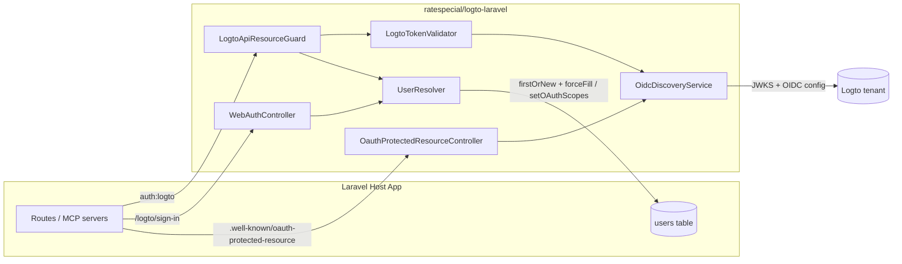
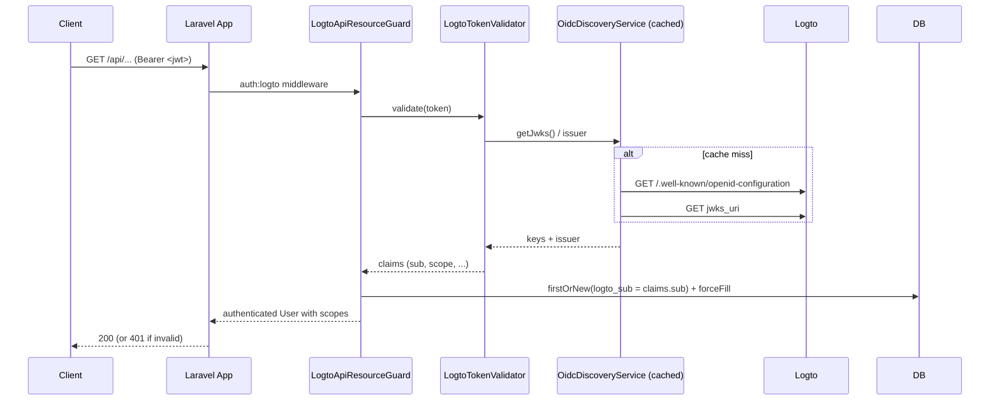
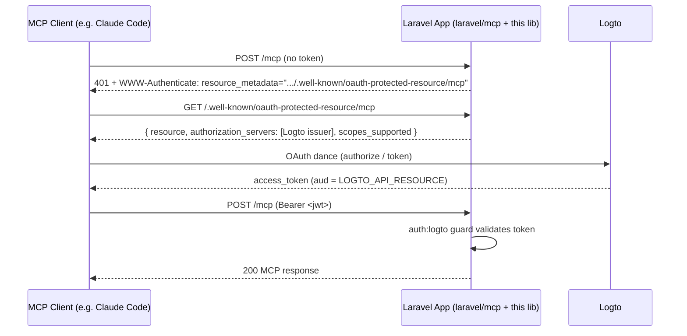
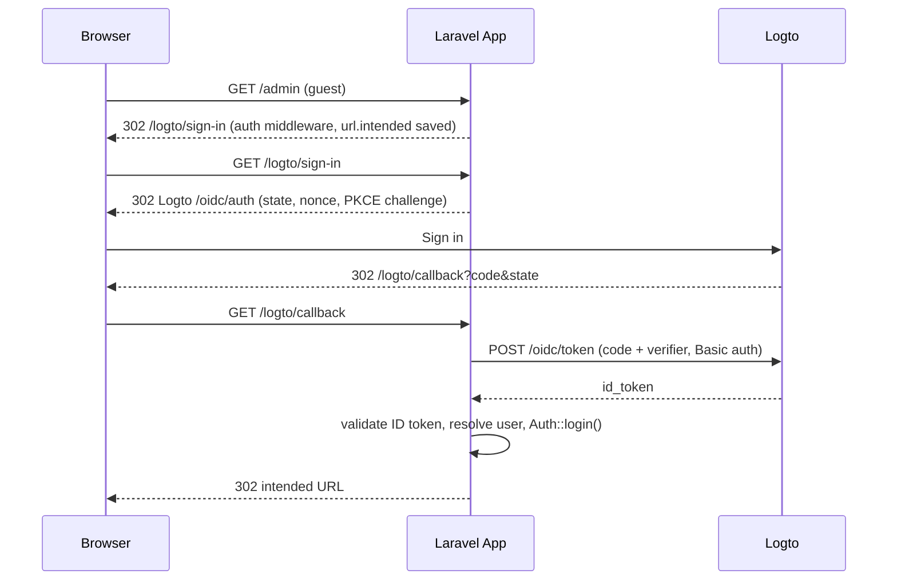

# logto-laravel

Logto.io (OAuth/OIDC) support for Laravel. This package contributes three independent features:

1. **`logto-api-resource` guard** — a Laravel auth guard that validates Logto-issued JWT access tokens and JIT-provisions users.
2. **MCP protected-resource controller** — an [RFC 9728](https://www.rfc-editor.org/rfc/rfc9728) `/.well-known/oauth-protected-resource` endpoint that lets [`laravel/mcp`](https://github.com/laravel/mcp) use Logto as its identity provider instead of Passport or Sanctum.
3. **Web sign-in** (opt-in) — an OIDC Authorization Code + PKCE flow so Blade/server-rendered apps can sign users in through Logto with a normal Laravel session guard.

**Requirements:** PHP `^8.3`, Laravel 12 or 13 (what the test suite runs against), a Logto tenant.

## Table of Contents

- [Installation](#installation)
- [Configuration](#configuration)
- [High-level Architecture](#high-level-architecture)
- [JIT User Provisioning](#jit-user-provisioning)
  - [Migrating Logto tenants](#migrating-logto-tenants)
- [Feature 1 — The `logto-api-resource` Guard](#feature-1--the-logto-api-resource-guard)
  - [Request flow](#request-flow)
  - [Migrations](#migrations)
  - [User model](#user-model)
  - [Guard registration](#guard-registration)
  - [Protecting routes](#protecting-routes)
  - [Reacting to new users](#reacting-to-new-users)
  - [Tokens without an email](#tokens-without-an-email)
- [Feature 2 — MCP Protected Resource Controller](#feature-2--mcp-protected-resource-controller)
  - [Discovery handshake](#discovery-handshake)
  - [Logto configuration](#logto-configuration)
  - [Enable the discovery routes](#enable-the-discovery-routes)
  - [Protecting an `Mcp::web` server with the Logto guard](#protecting-an-mcpweb-server-with-the-logto-guard)
  - [Adding the MCP server to Claude Code](#adding-the-mcp-server-to-claude-code)
- [Feature 3 — Web sign-in (Authorization Code + PKCE)](#feature-3--web-sign-in-authorization-code--pkce)
  - [Logto configuration (Traditional Web app)](#logto-configuration-traditional-web-app)
  - [Enable the routes](#enable-the-routes)
  - [Protecting pages](#protecting-pages)
  - [Behind a load balancer](#behind-a-load-balancer)
  - [Errors](#errors)
  - [Limiting who can sign in](#limiting-who-can-sign-in)
- [Development](#development)
- [License](#license)

## Installation

```bash
composer require ratespecial/logto-laravel
```

The service provider is auto-registered via Laravel's package discovery.

## Configuration

The package reads all of its settings from `config/logto.php` (merged automatically via `mergeConfigFrom`, not publishable), which is driven by `LOGTO_*` environment variables. Nothing needs to be added to `config/services.php`. Set these in your host app's `.env`:

```dotenv
LOGTO_ENDPOINT=https://your-tenant.logto.app
LOGTO_API_RESOURCE=https://api.example.com
LOGTO_CACHE_TTL=600
LOGTO_SUBJECT_COLUMN=logto_sub

# MCP feature (off by default)
LOGTO_MCP_ROUTES=true
LOGTO_MCP_SCOPES="mcp:use"

# Web sign-in feature (off by default)
LOGTO_WEB_ROUTES=true
LOGTO_WEB_APP_ID=your-traditional-web-app-id
LOGTO_WEB_APP_SECRET=your-app-secret
```

| Env var | Config key | Default | Purpose |
| --- | --- | --- | --- |
| `LOGTO_ENDPOINT` | `logto.endpoint` | — | Your Logto tenant URL. **Required.** |
| `LOGTO_API_RESOURCE` | `logto.api-resource` | `app.url` | JWT audience this API accepts. |
| `LOGTO_CACHE_TTL` | `logto.cache-ttl` | `600` | TTL (seconds) for cached OIDC discovery + JWKS. |
| `LOGTO_SUBJECT_COLUMN` | `logto.subject-column` | `logto_sub` | User-model column that stores the JWT `sub` claim. |
| `LOGTO_LINK_UNCLAIMED_BY_EMAIL` | `logto.link-unclaimed-by-email` | `false` | Let a new `sub` claim an existing user whose subject is null and whose email matches. See [Migrating Logto tenants](#migrating-logto-tenants). |
| `LOGTO_PROVISION_WITHOUT_EMAIL` | `logto.provision-without-email` | `false` | Save a user row even when there is no email. See [Tokens without an email](#tokens-without-an-email). |
| `LOGTO_MCP_ROUTES` | `logto.mcp.routes` | `false` | Enables the RFC 9728 discovery routes. |
| `LOGTO_MCP_SCOPES` | `logto.mcp.scopes-supported` | `mcp:use` | Space-delimited scopes advertised in the discovery metadata. |
| `LOGTO_MCP_PROTECTED_RESOURCE_MIDDLEWARE` | `logto.mcp.protected-resource-middleware` | `''` | Comma-delimited middleware applied to the discovery route. |
| `LOGTO_WEB_ROUTES` | `logto.web.routes` | `false` | Enables the web sign-in routes. |
| `LOGTO_WEB_APP_ID` | `logto.web.app-id` | `''` | App ID of the Logto Traditional Web application. |
| `LOGTO_WEB_APP_SECRET` | `logto.web.app-secret` | `''` | App secret of that application. |
| `LOGTO_WEB_PREFIX` | `logto.web.prefix` | `logto` | URL prefix for the routes. |
| `LOGTO_WEB_GUARD` | `logto.web.guard` | `web` | Session guard users are logged in to. |
| `LOGTO_WEB_MIDDLEWARE` | `logto.web.middleware` | `web` | Comma-delimited middleware for the routes. Must include sessions. |
| `LOGTO_WEB_SCOPES` | `logto.web.scopes` | `openid profile email` | Space-delimited scopes requested. |
| `LOGTO_WEB_RESOURCE` | `logto.web.resource` | — | Optional API resource; when set the user needs at least one scope on it. |
| `LOGTO_WEB_REDIRECT_AFTER_LOGIN` | `logto.web.redirect-after-login` | `/` | Fallback destination when there is no intended URL. |
| `LOGTO_WEB_REDIRECT_AFTER_LOGOUT` | `logto.web.redirect-after-logout` | `/` | Where Logto sends the browser after sign-out. |

The JWT-claim → user-model attribute mapping defaults to `email` and `name`. Override `logto.model-attributes` by setting it at runtime, for example `config(['logto.model-attributes' => [...]])` in a service provider's `register()`.

## High-level Architecture


```mermaid
flowchart LR
    subgraph App[Laravel Host App]
      Routes[Routes / MCP servers]
      User[(users table)]
    end

    subgraph Lib[ratespecial/logto-laravel]
      Guard[LogtoApiResourceGuard]
      Resolver[UserResolver]
      WebCtrl[WebAuthController]
      Validator[LogtoTokenValidator]
      Discovery[OidcDiscoveryService]
      MCPCtrl[OauthProtectedResourceController]
    end

    Logto[(Logto tenant)]

    Routes -- auth:logto --> Guard
    Guard --> Validator --> Discovery
    Discovery -- JWKS + OIDC config --> Logto
    Guard --> Resolver
    WebCtrl --> Resolver
    Resolver -- firstOrNew + forceFill / setOAuthScopes --> User
    Routes -- /logto/sign-in --> WebCtrl
    Routes -- .well-known/oauth-protected-resource --> MCPCtrl
    MCPCtrl --> Discovery
```

---

## JIT User Provisioning

This package uses **just-in-time (JIT) user provisioning**: there is no separate registration flow. The first time a given Logto identity (`sub` claim) presents a valid access token to your API, the guard resolves the user with `firstOrNew` keyed by `logto.subject-column` and inserts a new row. On every subsequent request, the same row is found and updated with any mapped claim attributes (email, name, etc.). Mapped attributes are written with `forceFill`, so they're persisted even if your user model doesn't list them in `$fillable` — the values come from a validated JWT, not request input.

Users without an email are not stored — see [Tokens without an email](#tokens-without-an-email).

The subject must be assigned at least one permission to the API resource in Logto.  If they don't, the guard will reject them and the user will not be provisioned. 

> ⚠️ Any token Logto has signed for your configured `LOGTO_API_RESOURCE` audience will result in a user record being created automatically the first time it's seen. There is no manual approval step. If you need to restrict who can sign in, enforce that in Logto (sign-in experience, roles, organization membership, or by minting tokens with specific scopes) — not in this package. You can also listen for `UserProvisionedEvent` to audit or post-process new accounts.

---

### Migrating Logto tenants

When moving to a new Logto tenant, every user gets a new `sub`. To let existing users keep their records, set the old subject column to `NULL` and enable `LOGTO_LINK_UNCLAIMED_BY_EMAIL=true`. When no user matches a token's `sub`, the guard looks for a user with a null subject whose email column (the column mapped from the `email` claim in `logto.model-attributes`) exactly matches the token's `email` claim, and writes the new `sub` onto that record. No `UserProvisionedEvent` is dispatched for a linked record.

> ⚠️ Anyone who can obtain a token from the new tenant carrying a victim's email will take over that victim's unclaimed record. Make sure the new tenant only issues verified emails, and turn this off once users have migrated. Access tokens must include the `email` claim (a Logto custom JWT claim), and matching is exact, so case differences won't link.

## Feature 1 — The `logto-api-resource` Guard

The guard:

- Reads the bearer token from the incoming request.
- Validates signature, issuer (`iss`), and audience (`aud`) against Logto's OIDC discovery document and JWKS — both cached for `LOGTO_CACHE_TTL` seconds.
- JIT-provisions a user via `firstOrNew` keyed on `logto.subject-column`, then `forceFill`s and saves it. Attributes are mapped from JWT claims using `logto.model-attributes` and persist regardless of the model's `$fillable`.
- Attaches the `scope` claim to the in-memory user. A global `Gate::before` hook then makes `can:<scope>` middleware and `$user->can('<scope>')` work transparently.
- Dispatches `Ratespecial\Logto\Events\UserProvisionedEvent` the first time a given `sub` is seen.

### Request flow


```mermaid
sequenceDiagram
    participant Client
    participant App as Laravel App
    participant Guard as LogtoApiResourceGuard
    participant Validator as LogtoTokenValidator
    participant Discovery as OidcDiscoveryService (cached)
    participant Logto
    participant DB

    Client->>App: GET /api/... (Bearer <jwt>)
    App->>Guard: auth:logto middleware
    Guard->>Validator: validate(token)
    Validator->>Discovery: getJwks() / issuer
    alt cache miss
        Discovery->>Logto: GET /.well-known/openid-configuration
        Discovery->>Logto: GET jwks_uri
    end
    Discovery-->>Validator: keys + issuer
    Validator-->>Guard: claims (sub, scope, ...)
    Guard->>DB: firstOrNew(logto_sub = claims.sub) + forceFill
    Guard-->>App: authenticated User with scopes
    App-->>Client: 200 (or 401 if invalid)
```

### Migrations

The user model must have a column matching `logto.subject-column` (default `logto_sub`). Two migration groups are publishable — pick the one that fits your project:

```bash
# Fresh project — full users table with the subject column included
php artisan vendor:publish --tag=logto-migrations-users

# OR — existing users table; just add the logto_sub column
php artisan vendor:publish --tag=logto-migrations-logto-sub

php artisan migrate
```

If you want a different column name, publish the migration, rename the column, and set `LOGTO_SUBJECT_COLUMN` to match.

### User model

Your user model must use the `HasOAuthScopes` trait and implement the `OAuthScopable` contract so the guard can write scopes to it and the `Gate::before` hook can read them back.

```php
namespace App\Models;

use Illuminate\Foundation\Auth\User as Authenticatable;
use Ratespecial\Logto\Contracts\OAuthScopable;
use Ratespecial\Logto\HasOAuthScopes;

class User extends Authenticatable implements OAuthScopable
{
    use HasOAuthScopes;

    protected $fillable = ['name', 'email', 'logto_sub'];
}
```

### Guard registration

The service provider auto-merges an `auth.guards.logto` entry, but you still need to point its `provider` at one of your `auth.providers.*` entries. In `config/auth.php`:

```php
'guards' => [
    'logto' => [
        'driver'   => 'logto-api-resource',
        'provider' => 'users',
    ],
],

'providers' => [
    'users' => [
        'driver' => 'eloquent',
        'model'  => App\Models\User::class,
    ],
],
```

### Protecting routes

```php
use Illuminate\Support\Facades\Route;
use App\Http\Controllers\OrderController;

// Authenticate only
Route::get('/api/me', fn () => auth('logto')->user())
    ->middleware('auth:logto');

// Authenticate + require a Logto OAuth scope
Route::get('/api/orders', [OrderController::class, 'index'])
    ->middleware(['auth:logto', 'can:orders:read']);
```

`can:orders:read` works because the service provider installs a `Gate::before` hook that delegates ability checks to `$user->hasOAuthScope($ability)`. The same is true of programmatic checks like `$user->can('orders:read')` or `Gate::allows('orders:read')`.

### Reacting to new users

```php
use Illuminate\Support\Facades\Event;
use Ratespecial\Logto\Events\UserProvisionedEvent;

Event::listen(function (UserProvisionedEvent $event) {
    // $event->user is the freshly-created Authenticatable
    // Send a welcome email, kick off onboarding, etc.
});
```

The event is not dispatched for users that are linked rather than created, or for transient users (below).

### Tokens without an email

A user row is only inserted when the token carries an email. If no existing row matches the `sub` and the `email` claim is empty, the guard still authenticates the request but returns an **unsaved (transient) user** with the subject and scopes set. `auth:logto` and `can:` work, nothing is written to the database, and no `UserProvisionedEvent` fires. This suits machine-to-machine (`client_credentials`) tokens, which have no human behind them. A row that already matches the `sub` is still loaded, updated and saved as normal.

Because your code may receive a user with no primary key, don't rely on `$user->id`/relations for such requests. Set `LOGTO_PROVISION_WITHOUT_EMAIL=true` to always store a row.

> **Logto access tokens only contain `email` if you add a custom JWT claim for it in Logto** (Console → Custom JWT → access token). Without that claim, human users arriving via bearer tokens are transient too. ID tokens (used by [web sign-in](#feature-3--web-sign-in-authorization-code--pkce)) include `email` from the `email` scope.

The rule only applies when the `email` claim is mapped in `logto.model-attributes` (the default). If you remove that mapping, users are saved regardless.

---

## Feature 2 — MCP Protected Resource Controller

[`laravel/mcp`](https://github.com/laravel/mcp) ships with first-class support for Laravel Passport. This package adds a parallel discovery endpoint so MCP clients (e.g. Claude Code) can authenticate against your **Logto** tenant instead.

It exposes RFC 9728 metadata at:

- `GET /.well-known/oauth-protected-resource`
- `GET /.well-known/oauth-protected-resource/{path?}` (named `mcp.oauth.protected-resource.nested`)

`laravel/mcp`'s `AddWwwAuthenticateHeader` middleware builds the `WWW-Authenticate` URL from the nested route name, so simply registering these routes wires the discovery handshake end-to-end. **These endpoints must not sit behind authentication middleware** — they're public discovery documents.

> **Note on the OAuth model.** This integration does **not** use [Dynamic Client Registration](https://datatracker.ietf.org/doc/html/rfc7591) (DCR) or [Client ID Metadata](https://workos.com/blog/client-id-metadata-documents-cimd-oauth-client-registration-mcp) (CIMD). The MCP client uses a **pre-registered OAuth client ID** that you create up-front in Logto as a *Third-party app*. The client and its allowed redirect URIs must exist in Logto before the user adds the MCP server to their client.

### Discovery handshake


```mermaid
sequenceDiagram
    participant MCPClient as MCP Client (e.g. Claude Code)
    participant App as Laravel App (laravel/mcp + this lib)
    participant Logto

    MCPClient->>App: POST /mcp (no token)
    App-->>MCPClient: 401 + WWW-Authenticate: resource_metadata=".../.well-known/oauth-protected-resource/mcp"
    MCPClient->>App: GET /.well-known/oauth-protected-resource/mcp
    App-->>MCPClient: { resource, authorization_servers: [Logto issuer], scopes_supported }
    MCPClient->>Logto: OAuth dance (authorize / token)
    Logto-->>MCPClient: access_token (aud = LOGTO_API_RESOURCE)
    MCPClient->>App: POST /mcp (Bearer <jwt>)
    App->>App: auth:logto guard validates token
    App-->>MCPClient: 200 MCP response
```

### Logto configuration

Before any MCP client can connect, set up the OAuth client in Logto:

1. In the Logto admin console, create a new **Third-party app** for each MCP client you want to support (e.g. one for Claude Code, one for Cursor, etc.).
2. Set the application type to **Single Page App**.
3. The generated **App ID** is what the MCP client will use as its OAuth Client ID.
4. Under the third-party app's **Redirect URIs**, pre-register every loopback callback URL the client will use, including the exact port — e.g. `http://localhost:55910/callback`. Logto will reject the OAuth flow if the callback URI doesn't match an entry here, so the port has to be picked up-front and reused when the MCP server is added on the client side.
5. Grant the third-party app permission to request your API resource (the value of `LOGTO_API_RESOURCE`) and any scopes from `LOGTO_MCP_SCOPES`.

### Enable the discovery routes

```dotenv
LOGTO_MCP_ROUTES=true
LOGTO_MCP_SCOPES="mcp:use"
```

When `logto.mcp.routes` is true, the service provider loads `routes/mcp-routes.php`, which registers both `/.well-known/oauth-protected-resource` endpoints. The advertised `scopes_supported` array comes from `LOGTO_MCP_SCOPES` (space-delimited).

### Protecting an `Mcp::web` server with the Logto guard

In `routes/ai.php`:

```php
use Laravel\Mcp\Facades\Mcp;
use App\Mcp\Servers\MyServer;

Mcp::web('/mcp', MyServer::class)
    ->middleware(['auth:logto', 'can:mcp:use']);
```

- `auth:logto` runs the bearer token through `LogtoApiResourceGuard`.
- `can:mcp:use` enforces a Logto OAuth scope via the same `Gate::before` hook the guard installs — `mcp:use` here is whatever scope you defined in Logto and advertised in `LOGTO_MCP_SCOPES`.
- On a missing or invalid token, `laravel/mcp`'s `AddWwwAuthenticateHeader` injects the `WWW-Authenticate` header pointing at this library's nested discovery route. No extra wiring required.

### Adding the MCP server to Claude Code

Because the OAuth client and its callback URI are pre-registered in Logto, the user has to pass both the **Client ID** (the Logto third-party App ID) and the **callback port** (matching one of the redirect URIs registered in Logto) when they add the MCP server:

```bash
claude mcp add \
    --transport http \
    --client-id your-3rdparty-app-id \
    --callback-port 55910 \
    yourservice https://domain.com/mcp
```

The discovery handshake then kicks in automatically — Claude Code hits `/mcp`, gets a `401` with the `WWW-Authenticate` header, fetches `/.well-known/oauth-protected-resource/mcp`, and runs the OAuth flow against the Logto issuer returned in the metadata using the supplied client ID and callback port.

---

## Feature 3 — Web sign-in (Authorization Code + PKCE)

For Blade/server-rendered apps (for example an admin portal). The package adds three routes that send the browser to Logto, handle the callback and log the user in to a **normal Laravel session guard**, so `auth` middleware, `Auth::user()` and `@auth` keep working. The user is resolved exactly like the API guard does: lookup by `logto.subject-column`, optional [link by email](#migrating-logto-tenants), claim mapping and `UserProvisionedEvent`.

| Route | Name | Purpose |
| --- | --- | --- |
| `GET /{prefix}/sign-in` | `logto.sign-in` | Stores state, nonce and PKCE verifier in the session and redirects to Logto. |
| `GET /{prefix}/callback` | `logto.callback` | Verifies state, exchanges the code (client secret via HTTP Basic), validates the ID token (signature, `iss`, `aud` = app ID, `exp`, `nonce`), logs the user in, regenerates the session and redirects to the intended URL. |
| `POST /{prefix}/sign-out` | `logto.sign-out` | Logs out, invalidates the session and redirects to Logto's `end_session_endpoint` (falling back to a local redirect). |


```mermaid
sequenceDiagram
    participant Browser
    participant App as Laravel App
    participant Logto

    Browser->>App: GET /admin (guest)
    App-->>Browser: 302 /logto/sign-in (auth middleware, url.intended saved)
    Browser->>App: GET /logto/sign-in
    App-->>Browser: 302 Logto /oidc/auth (state, nonce, PKCE challenge)
    Browser->>Logto: Sign in
    Logto-->>Browser: 302 /logto/callback?code&state
    Browser->>App: GET /logto/callback
    App->>Logto: POST /oidc/token (code + verifier, Basic auth)
    Logto-->>App: id_token
    App->>App: validate ID token, resolve user, Auth::login()
    App-->>Browser: 302 intended URL
```

### Logto configuration (Traditional Web app)

1. In the Logto console create an application of type **Traditional web**.
2. **Redirect URI:** `<APP_URL>/<prefix>/callback`, for example `https://admin.example.com/logto/callback`. Logto requires an exact match, including `https`.
3. **Post sign-out redirect URI:** the absolute URL of `LOGTO_WEB_REDIRECT_AFTER_LOGOUT`, for example `https://admin.example.com/`.
4. Copy the **App ID** and **App secret** into `LOGTO_WEB_APP_ID` / `LOGTO_WEB_APP_SECRET`.
5. Make sure `LOGTO_ENDPOINT` is set, and that the [user migration](#migrations) has been run.

### Enable the routes

```dotenv
LOGTO_WEB_ROUTES=true
LOGTO_WEB_APP_ID=...
LOGTO_WEB_APP_SECRET=...
# Optional: LOGTO_WEB_PREFIX, LOGTO_WEB_GUARD, LOGTO_WEB_REDIRECT_AFTER_LOGIN, LOGTO_WEB_REDIRECT_AFTER_LOGOUT
```

The guard named by `LOGTO_WEB_GUARD` (default `web`) must be a session guard whose provider's model has the subject column. The user model does not need `HasOAuthScopes` unless you use `LOGTO_WEB_RESOURCE`. A user whose ID token has no email is **rejected** (not logged in transiently) unless `LOGTO_PROVISION_WITHOUT_EMAIL=true`.

### Protecting pages

Use ordinary `auth` middleware and send guests to the sign-in route. In `bootstrap/app.php`:

```php
->withMiddleware(function (Middleware $middleware): void {
    $middleware->redirectGuestsTo(fn () => route('logto.sign-in'));
})
```

Laravel stores the requested URL as `url.intended`, and the callback redirects back to it. Sign out with a form (CSRF-protected POST):

```blade
<form method="POST" action="{{ route('logto.sign-out') }}">@csrf <button>Sign out</button></form>
```

`redirectGuestsTo` applies to every guest redirect. JSON/API requests still get a `401` because Laravel only redirects requests that expect HTML, so API-only routes using `auth:logto` are unaffected. If you have several HTML areas with different sign-in pages, pass a closure that inspects `$request` instead.

### Behind a load balancer

The `redirect_uri` is built with `route('logto.callback')`, so Laravel must know the original scheme and host. Behind a load balancer configure trusted proxies so `X-Forwarded-Proto`/`Host` are honoured, otherwise the URI will be `http://...` and Logto will reject it:

```php
$middleware->trustProxies(at: '*', headers: Request::HEADER_X_FORWARDED_AWS_ELB);
```

Also make sure `APP_URL` is correct, since the sign-out redirect uses `url()`.

### Errors

The callback throws `Ratespecial\Logto\Exceptions\SignInException` (an `HttpException` with status 403 and a message that is safe to show) when state is missing or doesn't match, Logto returns an `error`, the code exchange or ID token validation fails, the user has no email, or the API resource scope check fails. Laravel renders it as a 403 page. To customise, register a renderer:

```php
$exceptions->render(fn (SignInException $e) => redirect('/')->withErrors(['logto' => $e->getMessage()]));
```

A misconfigured tenant (unreachable discovery document, missing app ID/secret) throws the usual exception, like the API guard.

### Limiting who can sign in

As with the API guard, any Logto user who can sign in to the application is provisioned. To restrict access, either gate on your own data (for example an `is_admin` column and middleware, as before), or set `LOGTO_WEB_RESOURCE` to an API resource and grant its scopes only to the right Logto roles: the callback requests an access token for that resource, validates it, and refuses sign-in when its `scope` is empty. The scopes are attached to the user for that request only; they are not persisted in the session.

---

## Development

QA is wired through Composer scripts:

```bash
composer qa           # fix-style → phpstan → test
composer test         # PHPUnit (orchestra/testbench, in-memory SQLite)
composer check-style  # Laravel Pint --test
composer phpstan      # PHPStan level 6
```

## License

MIT.
